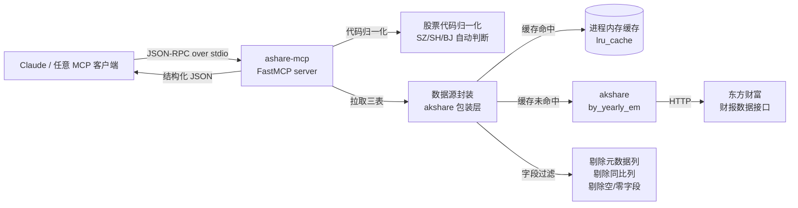

# ashare-mcp

> 把 A 股财报变成 LLM 可调的工具。An MCP server that turns Chinese A-share financial statements into tools your LLM can call.

让 Claude(或任何 MCP 客户端)用一句"平安银行 2024 年报怎么样?"直接拿到结构化的资产负债表 / 利润表 / 现金流量表,字段经过精选、单位明确、缓存友好。

数据来源东方财富,通过 [akshare](https://github.com/akfamily/akshare),全部免费、无需 token。

---

## 为什么再做一个

GitHub 上"金融 LLM"项目大多卷在 **trading agent** 和 **SEC 10-K RAG**——前者同质化严重,后者只服务美股。**A 股 + 中文 + MCP 协议层** 的组合几乎空白。

`ashare-mcp` 的定位很窄:**做 A 股财报这一件事,做到能被任何 LLM 客户端十秒接入**。它不预测股价、不写研报、不替你做决策——它只把数据从东方财富搬到 LLM 的工具调用里,字段干净、单位清楚、错误明确。

## 快速开始

```bash
git clone https://github.com/yli769227-jpg/ashare-mcp.git
cd ashare-mcp
python3 -m venv .venv && source .venv/bin/activate
pip install -e .
```

跑一次冒烟测试:

```bash
python -c "from ashare_mcp.data_source import get_annual_statements; \
  r = get_annual_statements('SZ000001', 2024); \
  print(r['company_name'], r['balance_sheet']['TOTAL_ASSETS'])"
# -> 平安银行 5769270000000.0
```

## 接入 Claude Desktop

编辑 `~/Library/Application Support/Claude/claude_desktop_config.json`(Mac):

```json
{
  "mcpServers": {
    "ashare": {
      "command": "/absolute/path/to/ashare-mcp/.venv/bin/python",
      "args": ["-m", "ashare_mcp.server"]
    }
  }
}
```

重启 Claude Desktop,就能直接问:

> 帮我看一下平安银行 2024 年报,总资产、总负债、净利润、经营性现金流分别多少?

## 工具列表

| 工具 | 输入 | 输出 |
|---|---|---|
| `get_three_statements` | `stock_code`, `year` | 年报三大表(精选 ~150 字段)|
| `cross_check_balance` | `stock_code`, `year` | 3 条勾稽校验结果 + 误差 + 行业通用 |
| `compare_peers` | `stock_codes[]`, `year`, `metrics?` | 同业 N 家横向对比 + 排名 / max-min-avg-std + ROE |

代码归一化支持 `000001` / `SZ000001` / `sz.000001` / `000001.SZ` 多种格式。

`cross_check_balance` 当前包含 4 条勾稽(前 3 条行业通用,第 4 条行业感知):

1. **资产负债平衡** — `TOTAL_ASSETS = TOTAL_LIABILITIES + TOTAL_EQUITY`
2. **现金流恒等式** — `NETCASH_OPERATE + NETCASH_INVEST + NETCASH_FINANCE + RATE_CHANGE_EFFECT = CCE_ADD`
3. **期末/期初现金对账** — `END_CCE − BEGIN_CCE = CCE_ADD`
4. **营业利润分解(行业感知)**
   - **银行**:`OPERATE_PROFIT = OPERATE_INCOME − OPERATE_EXPENSE`
   - **工商企业**:`OPERATE_PROFIT = TOTAL_OPERATE_INCOME − TOTAL_OPERATE_COST + OTHER_INCOME + INVEST_INCOME + FAIRVALUE_CHANGE_INCOME + ASSET_IMPAIRMENT_INCOME + CREDIT_IMPAIRMENT_INCOME + ASSET_DISPOSAL_INCOME [+ EXCHANGE_INCOME]`
   - **行业自动识别**:有 `ACCEPT_DEPOSIT > 10 亿` 走银行公式,有 `TOTAL_OPERATE_INCOME` + `TOTAL_OPERATE_COST` 走工商公式,否则 `skipped`(保险等暂不支持)

容忍度:前 3 条 1 万元(单项舍入),第 4 条 1000 万元(多项加总舍入累积)。字段缺失或行业无法识别时该条 `skipped`,不影响其它校验。实测 3 行业(银行 / 白酒 / 电池)4 家公司 2024 年报全过 4/4。

走 lru cache 联动:**先调 `get_three_statements` 后调 `cross_check_balance`,后者 < 1ms 秒回**(同一只股票数据已在内存)。

`compare_peers` 默认 metrics:`TOTAL_ASSETS / TOTAL_OPERATE_INCOME / PARENT_NETPROFIT / NETCASH_OPERATE / TOTAL_EQUITY`,自动派生 **`ROE = PARENT_NETPROFIT / 平均权益`**(本年期末权益 + 去年期末权益的均值,去年数据走 lru cache 几乎无成本;去年数据缺失时降级为期末权益,在 `roe_method` 字段标 `ending_equity_fallback`)。**自动 fallback**:银行业 `TOTAL_OPERATE_INCOME` 缺失时退到 `OPERATE_INCOME` 并在 `fallbacks` 字段标注。**并发实现**:ThreadPoolExecutor(max_workers=8),N 家公司并行拉(单家失败不挂整体,记入 `errors`)。实测 4 大银行 2024 年报对比 ~38s 跑完;招行 ROE 12.85%(零售之王长期领跑)。

## 架构



**关键设计**:

- **字段名保留东方财富原始英文**(`TOTAL_ASSETS` / `LOAN_ADVANCE` / `NETPROFIT`)。LLM 直接能理解,且银行 / 工商企业 / 保险等不同行业字段都在同一份字典里,无需做行业判断。
- **进程内存缓存**让"同一公司多年份对比"几乎零成本——冷启动一次拉全量,后续年份切换 < 1ms。
- **日志走 stderr**,不污染 MCP stdio 协议通道。

## 路线图

| 版本 | 工具 | 状态 |
|---|---|---|
| v0 | `get_three_statements` | ✅ |
| v1 | `cross_check_balance`(3 条行业通用勾稽) | ✅ |
| v1 | `compare_peers`(同业横向对比 + ROE 派生) | ✅ |
| v1.5(当前) | `cross_check_balance` + 营业利润分解(行业感知:银行 / 工商企业) | ✅ |
| v1.5(当前) | `compare_peers` 升级到 ROE_avg(平均权益) | ✅ |
| v2 | 跨年趋势工具 `track_company_history`(单公司多年 + CAGR) | 待定 |
| v2 | 季度数据 + 同比/环比派生指标 | 待定 |
| v2 | MCP 官方 registry 发布 | 待定 |

## 本地开发

```bash
# 增量验证(每次改完跑一遍)
python -c "from ashare_mcp.utils import normalize_stock_code; \
  assert normalize_stock_code('000001') == 'SZ000001'"

python -c "from ashare_mcp.server import mcp; \
  import asyncio; print([t.name for t in asyncio.run(mcp.list_tools())])"
```

## 数据声明

- 数据源:东方财富,通过 [akshare](https://github.com/akfamily/akshare)。
- 数据延迟、口径、准确性以东方财富为准,**不构成投资建议**。
- 仅用于教育与研究目的。

## License

MIT — see [LICENSE](./LICENSE).
